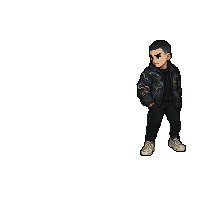

<!-- Header Image or Animated Avatar -->

  

<h1 align="center">Hi, I'm Vincent 👋</h1>

  🎮 Software Engineer • 🌐 Web Developer • 🕹️ Game Designer • 🎧 Sound Designer  

---

### 🧠 About Me

- 👨‍🎓 Recent Software Engineering graduate from the University of Texas at Arlington  
- 💻 I build creative, interactive experiences  
- 🎵 I also produce original soundtracks and sound effects for my projects  
- 🤖 Always exploring new tech in AI, web, and game development  
- ✨ I love turning ideas into engaging digital worlds

---

### 🛠️ Tech Stack

- **Languages:**   JavaScript • TypeScript • Python • C# • HTML/CSS • SQL • Java • C
- **Frameworks & Libraries:**  React • Next.js • Three.js • TailwindCSS • Bootstrap • React Three Fiber • Framer Motion • Node.js
- **Tools and Platforms:**       Git/GitHub • Excel • Visual Studio • Jira • Figma • Vercel • Linux • MATLAB • Unity • Godot

---

### ✉️ Let's Connect

- 💼 [Portfolio Website](https://vincentnguyen.vercel.app)

- 📫 Reach out via the contact form in my site or connect with me on [LinkedIn](https://www.linkedin.com/in/vincent-huu-nguyen/)  

- 🎵 Also on [Spotify](https://open.spotify.com/artist/5qp1vNdznp5vqk6Kvl0oUu?si=bD0Vou67SCOcT5h6iZUuvw) and [Soundcloud](https://soundcloud.com/kingvincev)

  
  
    
  

